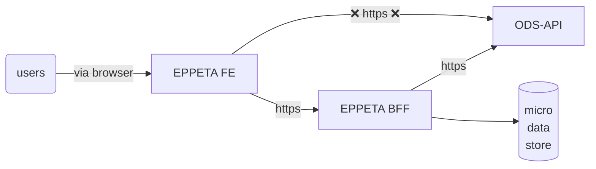
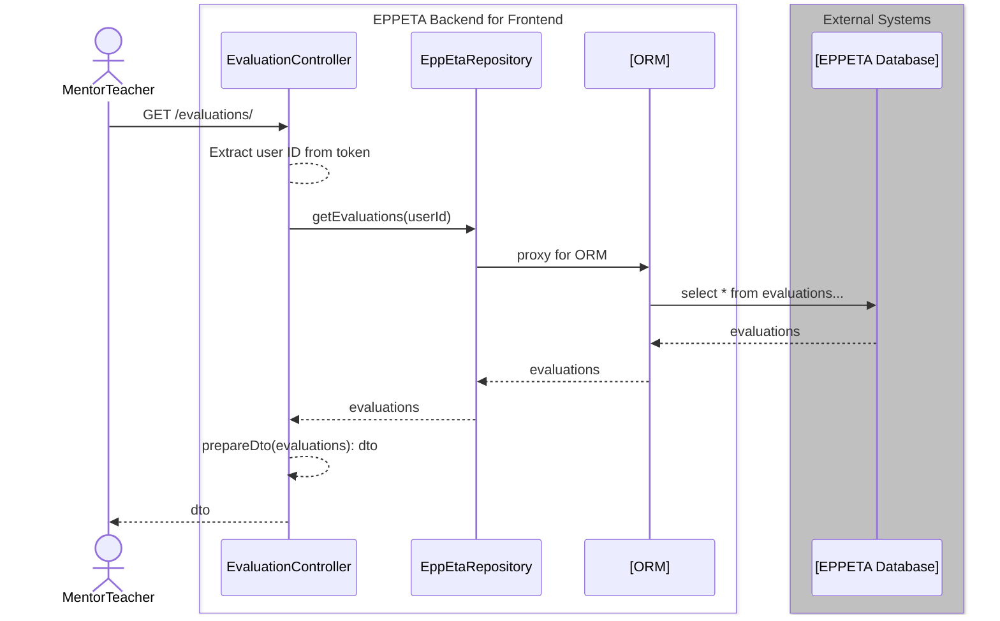
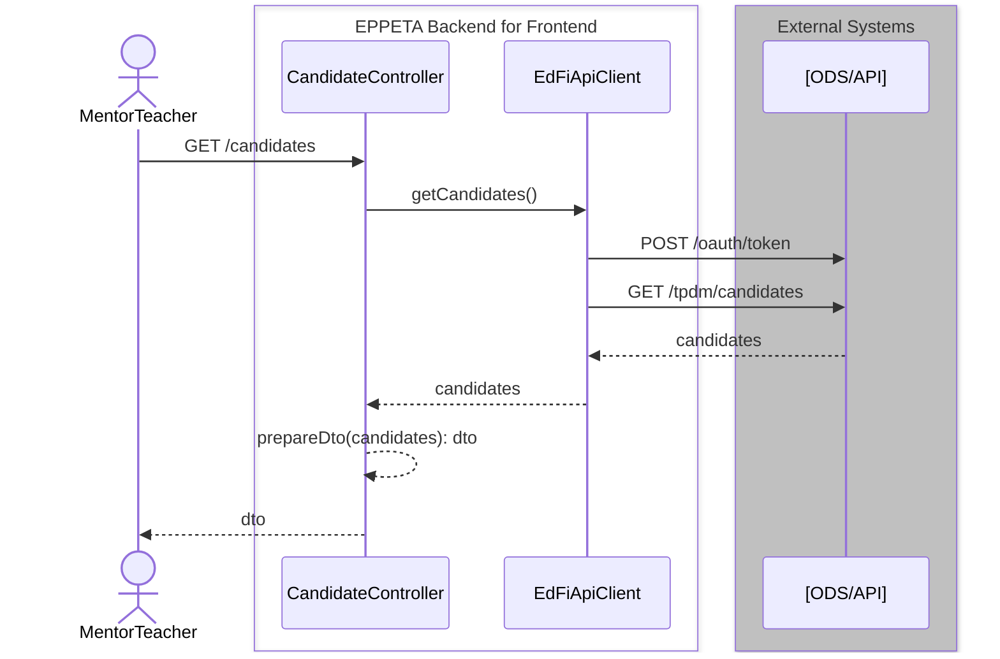

# EPP Evaluation Tracker System Architecture

## System Diagram

In the following diagram, "FE" means "front end" and "BFF" means backend for
frontend. Micro data store is a small database used to support the BFF. Each of
the components is described in more detail below.



## Frameworks and Technology Choices

### Frontend

- [React](https://react.dev/) in "plain JavaScript" (not Typescript, at least
  initially).
- [Chakra](https://chakra-ui.com/) component library.
- Assume that it will be hosted in IIS on Windows or in a web server like NGiNX
  or Apache if running on a Linux server.

### Backend for Frontend

- .NET 6, ASP.NET web api.
- Rejected alternative of Typescript for backend, because the educator prep
  programs (EPP's) most likely already have IIS running for support of ODS/API,
  and may not want to additionally install Node.js.
- Can use Entity Framework or Dapper for database interactions.

### Micro Data Store

- Store the BFF's data on a SQL Server database, under a unique schema name
  (`eppeta`).
- The schema and tables can exist in any SQL Server database: could be inside
  the primary ODS database, or another database on the same server, or a new
  database on an entirely different server. This is a deployment detail to be
  worked out on a case-by-case basis.
- Long-term, plan for managing tables separately from the BFF application. For
  quick start development, it could be acceptable to use Entity Framework with a
  code-first approach to deploying tables. In the longer term, it is not a good
  practice for the back-end application to rights to create (or drop!) tables in
  the destination database.

## Technical Requirements

### ODS/API Access

As depicted above, the EPPETA frontend application must not directly access the
ODS/API system. Instead, whenever ODS/API data are required, the backend service
should provide that access. The ODS/API will be hosted by the EPP host. The host
will need to provide a key and secret that will be used by the backend service.
The key and secret can initially be stored in the `appSettings.json` file.

### Backend Application Design

The following sequence diagrams suggest a possible layout of classes within the
application. This is just an example of some of the interactions between
classes.

#### Interactions with the BFF data store



#### Interactions with an Ed-Fi API



Ideally, the `POST /oauth/token` should not happen with every single call to the
ODS/API. Instead, keep the received token in memory. Try using it for the call
to the ODS/API. If the response if 401 or 403, then try the `POST /oauth/token`
again to recover from a token that has been timed out. But this retry should
only happen once. If it still receives a failure, then throw an exception: most
likely the credentials are bad.

### Classes and Categories of Classes

- Controllers
  - Create one controller for each type of resource that the BFF needs to
    provide to the FE. Details to be determined.
  - Controllers serve two purposes, violating the Single Responsibility
    Principle (SRP): (1) handle HTTP requests and responses and (2) holding
    business logic and mediating access to external resources. It is possible to
    separate these concerns, but in practice doing so in modern .NET
    applications provides extra overhead with little tangible benefit.
  - Ideally all controllers will have detailed unit tests. Therefore all
    external dependencies should be injected into the constructor, following the
    Dependency Inversion Principle (DIP).
- `EppEtaRepository`
  - This class should implement the `IEppEtaRepository` interface. Controllers
    would accept an injected parameter of type `IEppEtaRepository` for mediating
    database access. By using an interface here, we can write unit tests against
    the controller using a mock version of `IEppEtaRepository` instead of using
    the real `EppEtaRepository`.
  - The real class would access the database with the help of an ORM: either
    Entity Framework or Dapper.
  - Because of the use of the ORM, unit tests for `EppEtaRepository` are
    impractical and should not be attempted. However, time permitting,
    integration tests could be written that access a live database.
- `EdFiApiClient`
  - This class should implement the `IEdFiApiClient` interface, which can be
    injected into controllers as needed.
  - As with the repository layer, this interface facilitates easy unit testing
    of the controller.
  - We have (at least) three options for writing the interactions with the Ed-Fi API:
    1. Use `HttpClient` to hand-write interactions with the database.
    2. Use `RestSharp` to hand-write interactions with the database.
    3. Use [code generation to create an SDK](https://techdocs.ed-fi.org/display/ODSAPIS3V53/Using+Code+Generation+to+Create+an+SDK)
  - StephenF's recommendation: use the SDK. However, it will generate classes
    for every resource. Delete the classes that we don't plan to use, so that we
    do not have unnecessary code.
- Model classes
  - The sequence diagrams use the term "DTO", which means Data Transfer Object.
    This is one type of model class; the other represents data stored in
    external systems (database or API).
  - The object stored in the database or in the API might not be exactly what we
    need to send to the front end application. A DTO is simple POCO (plain old
    C# object) that has only the attributes needed by the front end. The
    controller needs to convert from the data storage model to the data transfer
    model. The function that does this transformation might actually be on the
    DTO class. For example, imagine that there is a class called `Candidate`
    that represents the candidate information available in the Ed-Fi API. Then
    we might have classes like this:

    ```csharp
    public class Candidate {
        public string Id { get; set; }
        public string CandidateIdentifier { get; set; }
        public string FirstName { get; set; }
        public string LastSurname { get; set; }
    }

    public class CandidateDto {
        public string CandidateName { get; set; }
        public string CandidateId { get; set; }

        public static CandidateDto Create(Candidate input) {
            return new CandidateDto {
                CandidateName = $"{input.FirstName} {input.LastSurname}",
                CandidateId = input.Id
            }
        }
    }
    ```
